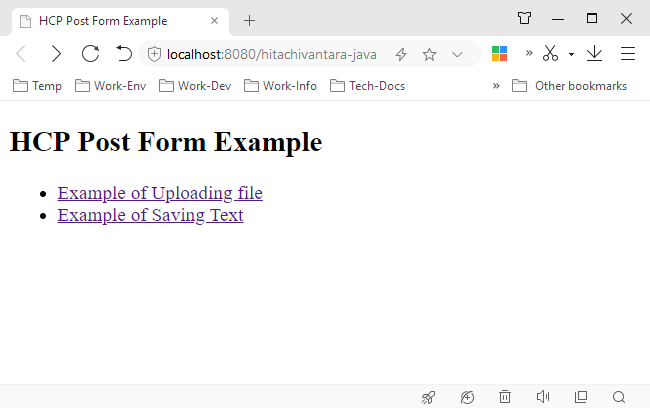
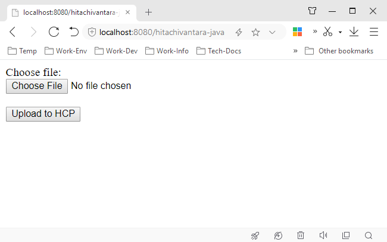
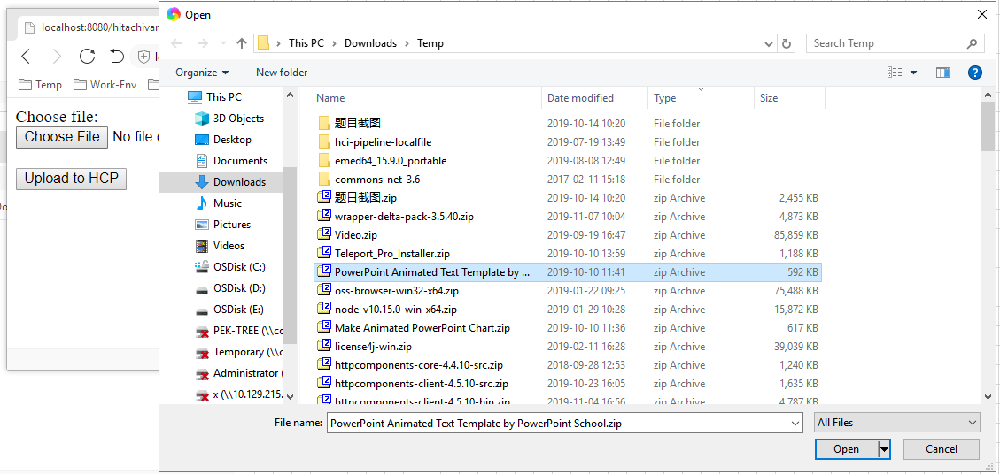
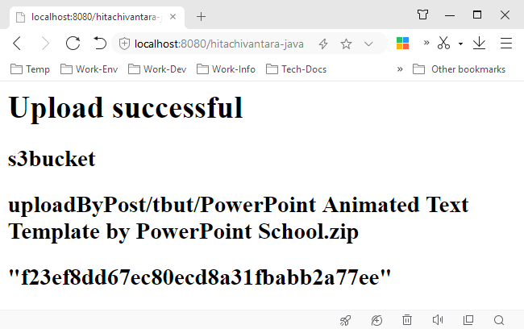
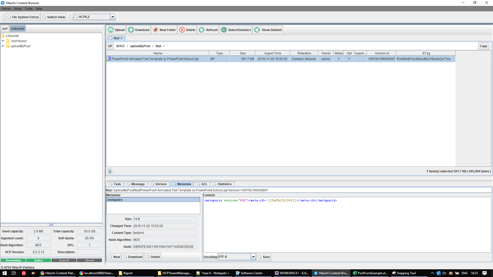

# hitachivantara-java-example-hcp-web
 You need to prepare a web container like Tomcat.
 
## Screenshot-1-Start web project
 

## Screenshot-2
 

## Screenshot-3
 

## Screenshot-4
 

## Screenshot-5
 
